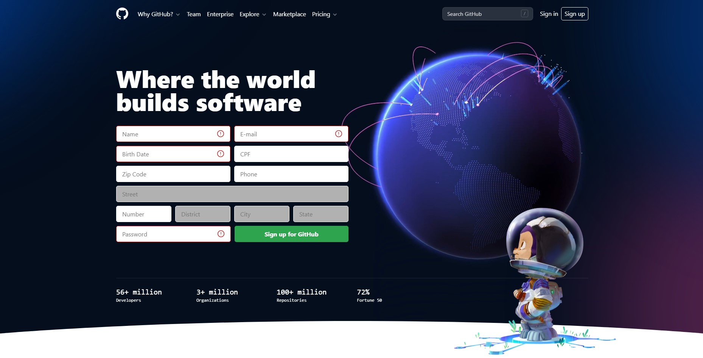
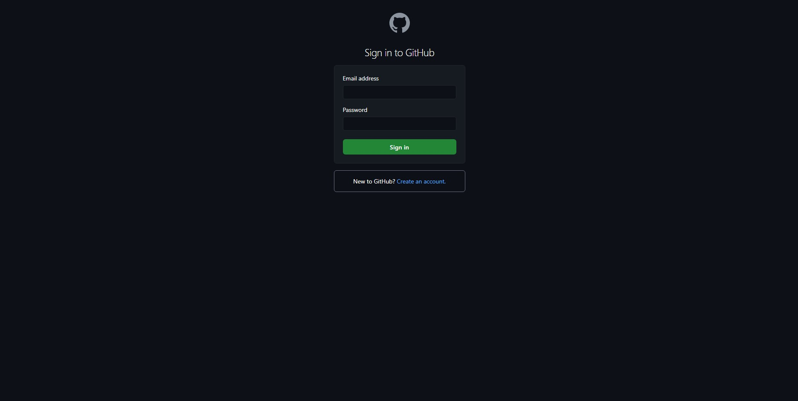
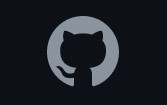

<div align="center">
  
  
</div>


<h1 id="about">Git Hub Tasklist Challenge</h1>

<p>📌 Este projeto tem o intuito realizar uma Tasklist, onde cada usuário visualiza as suas tarefas criadas e pode manipulá-las como quiser. O projeto foi construido utilizando Redux e Redux Persist<p>

<p align="center">
 <a href="#preview">Preview</a> •
 <a href="#technologies">Tecnologias</a> •
 <a href="#installation">Como usar</a>
</p>

<h2 align="left" id="preview">💻 Preview </h2>

<p>Clique na imagem abaixo e acesse uma prévia da aplicação diretamente na hospedagem da Vercel</p>
<a target="_blank" href="https://github-task-list.vercel.app"></a>

<h2 align="left" id="technologies">📐 Tecnologias </h2>

As seguintes ferramentas foram usadas na construção do projeto:

- [React](https://pt-br.reactjs.org)
- [Redux / Redux Persist](https://redux.js.org)
- [Styled Components](https://styled-components.com)
- [@Unform](https://github.com/unform/unform)
- [Yup](https://github.com/jquense/yup)

<h2 align="left" id="installation">🚀 Inicializando a aplicação</h2>

### Pré-requisitos

Antes de começar, você vai precisar ter instalado em sua máquina as seguintes ferramentas:
[Git](https://git-scm.com), [Node.js](https://nodejs.org/en/).
Além disto é bom ter um editor para trabalhar com o código como [VSCode](https://code.visualstudio.com/)

### 🎲 Rodando o Front End

```bash

# Clone este repositório
$ git clone https://github.com/GabrielTurra/github-task-list.git

```
### 🌎 Com o repositório clonado, siga os seguintes passos:

```bash

# Acesse a pasta do projeto no terminal/cmd
$ cd github-task-list

#Baixe as dependências do projeto
$ yarn

# Inicia a aplicação 
$ yarn start

# O servidor inciará na porta:3000 - acesse http://localhost:3000

```
